# School District Analysis

# Overview of the school district analysis: Explain the purpose of this analysis.

This analysis was performed on behalf of client PyCity School District in order to look deeper into factors that may affect reading and math scores at individual schools within the district. Upon discovery of anomalous scores within one grade at one school, further analysis was performed re-examining scores across the district with the removal of the anomalies.

# Results

## Effects on District Summary
The original summary of reading and math scores by district shows the following:

### Original District Summary

After removal of the anomalous scores (students in 9th grade at Thomas High School), the scores show the following.

### Updated District Summary

Overall,  district averages trended upward very slightly after the removal of the anomalous scores.

## Effects on Per School Summary
The original summary of reading and math scores by school shows the following:

### Original School Summary
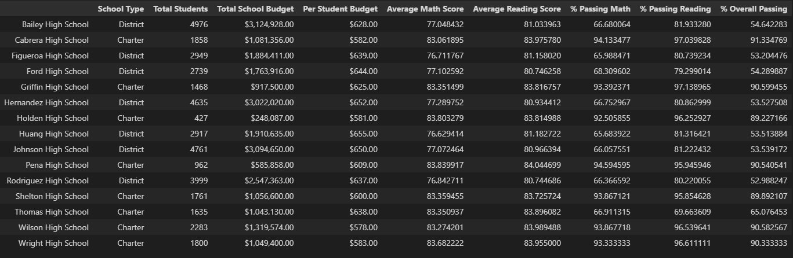

After removal of the anomalous scores (students in 9th grade at Thomas High School), the scores show the following.

### Updated School Summary
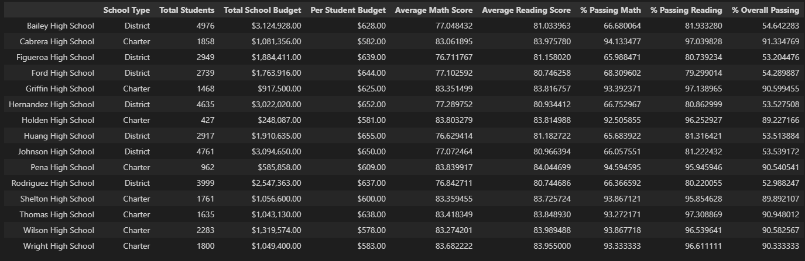

The removal of the anomalous 9th grade scores from Thomas High School brings about a significant increase in their reading, math, and overall passing student levels.

## Effects on Thomas High School Placement
In the original set of data, Thomas High School's performance was low in comparison to other schools. After removing the anomalous data, Thomas High School performs second among the fifteen schools analyzed.

### Updated List of Top 5 Schools
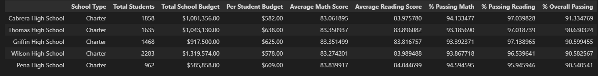

### Updated List of Bottom 5 Schools
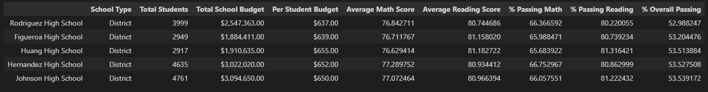

## Effects on Reading Scores by Grade
The original reading scores by grade were as follows:

### Original Reading Scores by Grade
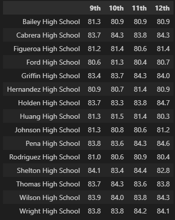

Updated reading scores by grade were as follows:

### Updated Reading Scores by Grade
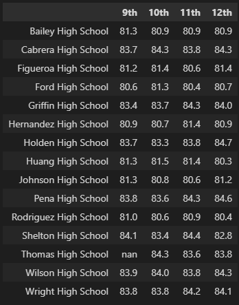

## Effects on Math Scores by Grade
The original math scores by grade were as follows:

### Original Math Scores by Grade
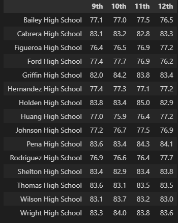

Updated math scores by grade were as follows:

### Updated Math Scores by Grade
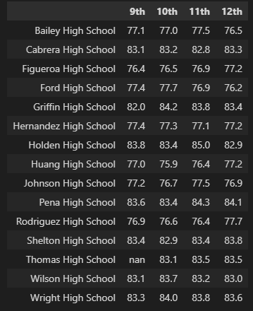

## Effects on Scores by School Spending
The original breakdown of scores by school spending levels was as follows:

### Original Scores by School Spending
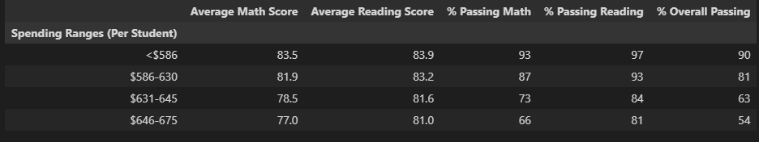

Updated scores by school spending levels were as follows:

### Updated Scores by School Spending
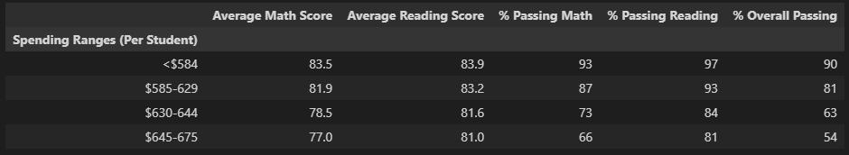

## Effects on Scores by School Size
The original breakdown of scores by school size was as follows:

### Original Scores by School Size
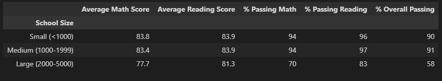

Updated scores by school size were as follows:

### Updated Scores by School Size
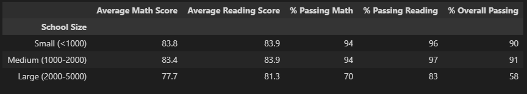

## Effects on Scores by School Type
The original breakdown of scores by school type was as follows:

### Original Scores by School Type

Updated scores by school type were as follows:

### Updated Scores by School Type

# Summary: Summarize four changes in the updated school district analysis after reading and math scores for the ninth grade at Thomas High School have been replaced with NaNs.
