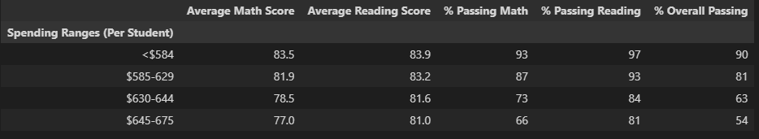
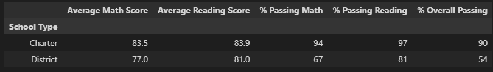
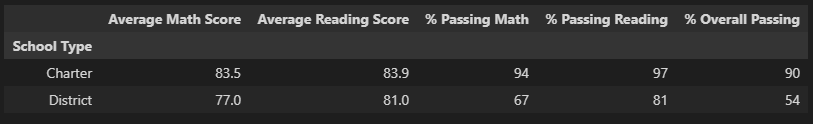

# School District Analysis

# Overview of the school district analysis: Explain the purpose of this analysis.

This analysis was performed on behalf of client PyCity School District in order to look deeper into factors that may affect reading and math scores at individual schools within the district. Upon discovery of anomalous scores within one grade at one school, further analysis was performed re-examining scores across the district with the removal of the scores from one sub-group.

# Results

## Effects on District Summary
The original summary of reading and math scores by district shows the following:

### Original District Summary

After removal of the anomalous scores (students in 9th grade at Thomas High School), the scores show the following.

### Updated District Summary

Overall, the removal of the anomalous scores showed only a small effect on the district summary. Average math scores went down slightly, from 79.0 to 78.9. Without conducting an analysis on the statistical significance of scores, it is difficult to say whether this shift is or is not within the expected range.

## Effects on Per School Summary
The original summary of reading and math scores by school shows the following:

### Original School Summary

After removal of the anomalous scores (students in 9th grade at Thomas High School), the scores show the following.

### Updated School Summary

As expected, the updates to the data set show no effect on any school other than Thomas High School. The removal of the anomalous 9th grade scores from Thomas High School brings about a significant increase in their reading, math, and overall passing student percentages, while leaving average scores relatively unchanged.
- Average Math Scores- negligible shift from 83.36 to 83.42
- Average Reading Scores- negligible shift from 83.90 to 83.85
- % Passing Math- shift upward from 66.9% to 93.3%
- % Passing Reading- shift upward from 69.7% to 97.3%
- % Overall Passing- shift upward from 65.1% to 91.0%

## Effects on Thomas High School Placement
Given that the analysis request for a ranking of schools was based on average scores, Thomas High School's ranking as 2nd remained the same after the data set was updated.

### Updated List of Top 5 Schools

### Updated List of Bottom 5 Schools

## Effects on Reading and Math Scores by Grade
Overall reading and math scores when broken out by school and grade remain unaffected. The largest difference in the data set is that the updated frames show the anomalous group of students with "NaN" rather than a score in both the reading and math frames.

### Original Reading Scores by Grade

Updated reading scores by grade were as follows:

### Updated Reading Scores by Grade

### Original Math Scores by Grade

Updated math scores by grade were as follows:

### Updated Math Scores by Grade

## Effects on Scores by School Spending
No changes in the effects on scores when sliced by school spending levels were apparent. The affected high school fell into the category of "$630-644", and the data remained unchanged before and after the removal.

The original breakdown of scores by school spending levels was as follows:

### Original Scores by School Spending

Updated scores by school spending levels were as follows:

### Updated Scores by School Spending

## Effects on Scores by School Size
No changes in the effects on scores when sliced by size were apparent. The affected high school fell into the category of "Medium (1000-2000)", and the data remained unchanged before and after the removal.

The original breakdown of scores by school size was as follows:

### Original Scores by School Size

Updated scores by school size were as follows:

### Updated Scores by School Size

## Effects on Scores by School Type
No changes in the effects on scores when sliced by type were apparent. The affected high school fell into the category of "Charter", and the data remained unchanged before and after the removal.

The original breakdown of scores by school type was as follows:

### Original Scores by School Type

Updated scores by school type were as follows:

### Updated Scores by School Type

# Summary: 
Summarize four changes in the updated school district analysis after reading and math scores for the ninth grade at Thomas High School have been replaced with NaNs.

In summary, a conclusion can be drawn that while the anomalous data showed no discernable effect on the district-wide reporting and analysis, there was a marked effect on any reporting and analysis to be done at the school level. Had an analysis of this type been used in order to target funds for schools in need of assistance, in order to target schools for additional or changes in staffing, or in order to evaluate schools for potential closure or re-districting, there could have been a dramatic mischaracterization of Thomas High School and its successes and struggles.

Analyses such as this have many real-world consequences, affecting things like property values in the school district, district- and county-level elections, and even scholarship opportunities for students. 
